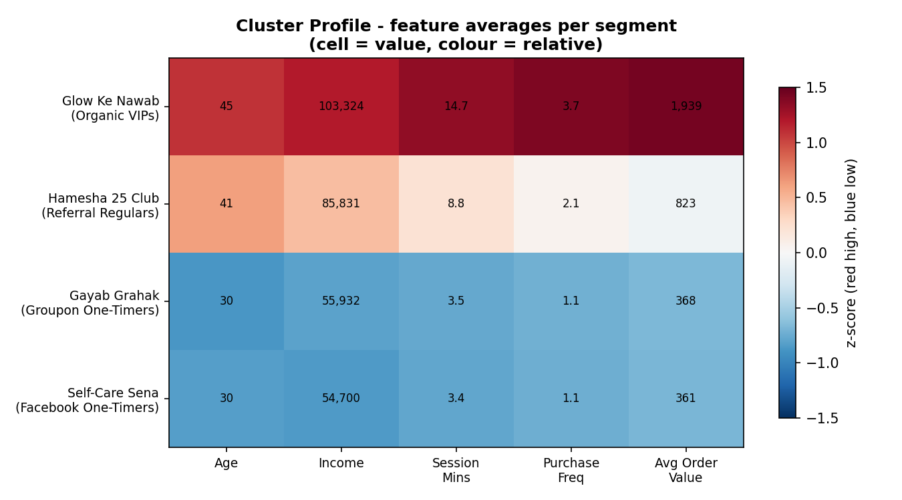
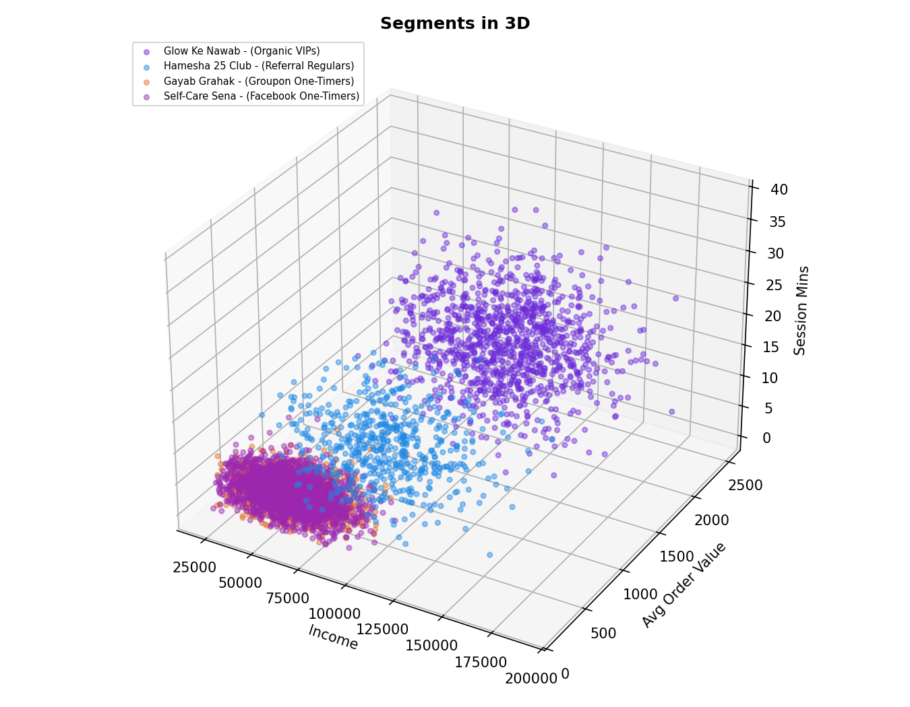

# Elevate MedSpa — Customer Segmentation & Marketing Audit

[](https://colab.research.google.com/github/Nishkarshmauryaa/medspa-customer-segmentation/blob/main/MedSpa_Customer_Segmentation.ipynb)


*An unsupervised machine-learning audit that segments 5,000 med-spa clients into behavioural cohorts, and uses them to show why a discount-led acquisition strategy is quietly losing money — with an honest read on what the data does and does not support.*


---

## Overview

**Elevate Aesthetics** is a premium medical spa (fictional, used here for demonstration) offering treatments such as laser therapy, CoolSculpting, and medical-grade facials priced between **$500 and $2,500**. A loyal client who visits quarterly is worth over **$4,000 a year**.

The owner has been driving foot traffic with *"50% off your first treatment"* ads on Facebook and Groupon. The waiting room is full, but margins are thin. This project audits a simulated CRM export of 5,000 clients to test a single hypothesis: **the cheap-lead strategy is attracting the wrong customers.**

The analysis lives in a Python notebook (K-Means segmentation) and an interactive Power BI dashboard.

> All data is simulated for demonstration purposes. No real company or customer data is used. Currency figures are illustrative ($).

---

## Key Findings

*Segment names are playful Hindi-English labels; each plain-English descriptor is in italics, with fuller profiles under [Customer Segments](#customer-segments).*

| Segment | Clients | Revenue | Share | Avg Order Value | Repeat Rate |
|---|---:|---:|---:|---:|---:|
| **Glow Ke Nawab** *(Organic VIPs)* | 1,135 | $8.2M | 77.9% | $1,939 | 98% |
| **Hamesha 25 Club** *(Referral Regulars)* | 574 | $1.0M | 9.3% | $823 | 70% |
| **Self-Care Sena** *(Facebook one-timers)* | 2,069 | $0.8M | 8.0% | $361 | 10% |
| **Gayab Grahak** *(Groupon one-timers)* | 1,222 | $0.5M | 4.8% | $368 | 10% |

- **Revenue is extremely concentrated.** The Organic VIP cohort is ~23% of clients but drives **~78% of revenue** at a ~98% repeat rate.
- **Discount channels are the volume, not the value.** The two one-timer cohorts (Self-Care Sena + Gayab Grahak) total **3,291 clients — 66% of the base** — but under **13% of revenue**, with ~90% never returning after the first visit.
- **The signal lives in the acquisition channel.** Lifetime value per client ranges from **~$7,050 (Organic)** to **~$410 (Facebook/Groupon)** — a ~17x gap that tracks almost entirely with *how the client was acquired*, not their age, gender, or location.

---

## Strategic Recommendation

The clearest data-supported action is to **stop subsidising one-and-done discount traffic and reinvest in the channels that retain.**

1. **Cut or cap the "50% off" Facebook/Groupon spend.** These channels fill the calendar but churn ~90% after one discounted visit, eroding margin on every appointment.
2. **Reallocate budget to organic and referral acquisition** (educational content, consultation funnels, referral incentives), which together produce ~87% of revenue at far higher retention.
3. **Pivot from offer-led to authority-led marketing** — attract high-intent clients searching for expert treatment, not bargain hunters.

**The cost, in round numbers.** The ~3,291 Facebook/Groupon one-timers contribute under **$1.3M** combined yet consume the bulk of ad spend, and ~90% never rebook. At a ~$30 CPA that is **~$99K** of acquisition cost chasing the lowest-value clients — before counting the margin erased by the 50%-off first visit. Redirecting even 60% of that budget into **referral incentives** (e.g. $50 per referred client) and **organic/content acquisition** targets the cohorts that actually retain (Organic ~97%, Referral ~70%).

**A simple guardrail:** fund a channel only when projected **LTV:CAC clears ~3:1**. Organic clears it comfortably (~$7,050 LTV); discounted Facebook/Groupon (~$410 LTV) does not.

> Channel and demographic targeting *beyond acquisition source* should be treated as **hypotheses to validate with controlled A/B tests**, not conclusions. In this dataset, age, gender, and location are near-uniform across segments and provide no reliable targeting signal on their own.

---

## Customer Segments

> **Read this first.** The model clusters on **behavioural, financial, channel, and price-sensitivity features**. Segment *names are interpretive overlays.* The strongest separators are **acquisition channel, repeat behaviour, and order value** — the age/gender/location columns are roughly uniform across segments, so any demographic claim is a hypothesis to be tested, not a finding.

**Glow Ke Nawab — Organic VIPs (n = 1,135) — the revenue engine**
- *Data:* highest income (~$103k), oldest (~45), longest sessions (~15 min), most frequent (3.7 visits), highest AOV ($1,939); ~98% repeat; ~78% of total revenue. Almost entirely acquired via Organic Search.
- *Interpretation (hypothesis):* high-intent clients who research, book a consultation, pay full price, and return.

**Hamesha 25 Club — Referral Regulars (n = 574) — the steady middle**
- *Data:* mid income (~$86k), 2.1 visits, $823 AOV, 70% repeat; ~9% of revenue. Predominantly referral-acquired.
- *Interpretation (hypothesis):* trust-driven clients who arrive through word of mouth and convert reliably.

**Self-Care Sena — Facebook one-timers (n = 2,069) — high volume, low value**
- *Data:* young (~30), lower income (~$55k), 1.1 visits, $361 AOV, ~10% repeat; the **largest** cohort by headcount but only ~8% of revenue. Almost entirely Facebook-acquired.
- *Interpretation (hypothesis):* discount-motivated first-timers who claim the offer and leave.

**Gayab Grahak — Groupon one-timers (n = 1,222) — the leak**
- *Data:* near-identical to Self-Care Sena (young, low income, 1.1 visits, $368 AOV, ~10% repeat); ~5% of revenue. Groupon-acquired. *"Gayab Grahak" = the customer who vanishes.*
- *Interpretation (hypothesis):* deal-site bargain hunters with no intent to return at full price.

---

## Methodology

1. **Data validation** — confirmed the 5,000-row export was complete (no nulls, no duplicate `Client_ID`s) across all 12 columns.
2. **Feature selection** — five behavioural/financial signals (`Age`, `Income`, `Engagement_Time_Minutes`, `Purchase_Frequency`, `Average_Order_Value`) **plus** the two business-critical categoricals (`Acquisition_Source`, `Price_Sensitivity`), one-hot encoded.
3. **Standardisation** — `StandardScaler` on the numeric features so high-magnitude columns (income, revenue) don't dominate the distance calculation.
4. **Clustering** — `KMeans(n_clusters=4, init='k-means++', random_state=42)`.
5. **Validation & profiling** — chose *k* with elbow + silhouette analysis, then profiled each cluster's feature averages (heatmap) before mapping clusters to named segments.

> **On the choice of k = 4:** silhouette actually peaks at **k = 2** (~0.51), meaning the cleanest statistical split is simply *"high-value vs bargain-hunter."* **k = 4** was chosen for interpretability — it separates the four acquisition channels into actionable cohorts — and that trade-off is stated openly rather than hidden behind a metric.

> **Note on the dashboard vs the notebook:** the Power BI dashboard reflects an earlier clustering pass (numeric features only); the notebook here is the **refined version** with the channel and price variables added. The refined segmentation maps each cohort cleanly onto its acquisition source.

---

## Dataset

A simulated export of **5,000 med-spa clients x 12 columns**:

| Column | Type | Description |
|---|---|---|
| `Client_ID` | str | Unique client identifier |
| `Age` | int | Client age |
| `Gender` | cat | Female / Male / Non-binary |
| `Location` | cat | Urban / Suburban / Rural |
| `Income` | int | Annual income ($) |
| `User_Interest` | cat | Skincare / Anti-aging / Wellness |
| `Acquisition_Source` | cat | Facebook Ad / Groupon / Organic Search / Referral |
| `Device_Type` | cat | Mobile / Desktop / Tablet |
| `Engagement_Time_Minutes` | float | Avg session length |
| `Price_Sensitivity` | cat | High / Medium / Low |
| `Purchase_Frequency` | int | Visits in the period |
| `Average_Order_Value` | float | Mean spend per visit ($) |

A "churn / repeat" signal is **derived**, not given: a client is counted as *retained* when `Purchase_Frequency >= 2` (i.e. they came back at least once). This definition is stated explicitly so every retention figure is traceable to a formula.

---

## Visualisations

The clearest view of the segmentation is the **cluster profile** — the average of each feature per segment (cell = actual value, colour = relative to other segments):



Glow Ke Nawab stands out in red on every feature; the two one-timer cohorts sit blue and low, separated almost entirely by acquisition channel.

A 3D scatter (Income x Order Value x Session Duration) gives a complementary view:



Open `3d-persona-map.html` in a browser to explore it interactively, or run the notebook in Colab.

---

## Power BI Dashboard

An interactive Power BI dashboard (shown at the top) accompanies the analysis, with slicers for gender, location, segment, acquisition source, and price sensitivity; KPI cards (revenue, customers, AOV, retention); and revenue / lead-volume / retention breakdowns by channel and cohort.

- **File:** `Final_MedSpa_Dashboard.pbix` — open in Power BI Desktop to interact with the slicers.

---

## Skills Demonstrated

- Data validation, feature encoding, standardisation, and cluster profiling
- Unsupervised ML (K-Means) with elbow + silhouette validation
- Honest interpretation — separating evidence from narrative
- Communicating analysis as a testable business recommendation, across Python and Power BI

---

## Tech Stack

Python . pandas . NumPy . scikit-learn . Plotly . Matplotlib . Power BI . Google Colab

---

## Getting Started

**Run in Google Colab (recommended):** use the badge at the top of this page.

**Run locally:**
```bash
git clone https://github.com/Nishkarshmauryaa/medspa-customer-segmentation.git
cd medspa-customer-segmentation
pip install -r requirements.txt
jupyter notebook
```

---

## Project Structure

```
medspa-customer-segmentation/
├── README.md
├── requirements.txt
├── .gitignore
├── MedSpa_Customer_Segmentation.ipynb
├── medspa_customer_cohorts.csv
├── Final_MedSpa_Dashboard.pbix
├── cluster-profile-heatmap.png
├── 3d-persona-map.png
└── 3d-persona-map.html
```

---

## Limitations & Future Work

- **Simulated data, stated conclusion.** The data is synthetic and the case brief pre-states the expected outcome, so this project showcases the *workflow and communication*, not an independent discovery.
- **Retention is a proxy.** It means a repeat purchase (`Purchase_Frequency >= 2`), not time-windowed cohort retention (which would need visit timestamps).
- **The clusters mostly recover the channel.** Acquisition source dominates the encoded features, so the segments map almost 1:1 onto channels — handy for action, but it means K-Means adds little here beyond a channel grouping. **K-Prototypes** (Gower distance) would handle the mixed numeric/categorical data more rigorously.
- **Demographics don't separate segments.** Age, gender, and location are near-uniform across cohorts, so any demographic-targeting claim is a hypothesis for A/B testing, not a finding.

*Future work:* sync the Power BI dashboard to the refined clustering; validate channel/demographic hypotheses with controlled tests; train a classifier to score new clients into a segment; publish the dashboard via Power BI Service for a live link.

---

## Author

**Nishkarsh Maurya** . [GitHub](https://github.com/Nishkarshmauryaa) . [LinkedIn](www.linkedin.com/in/nishkarshmauryaa) . [Portfolio]()
